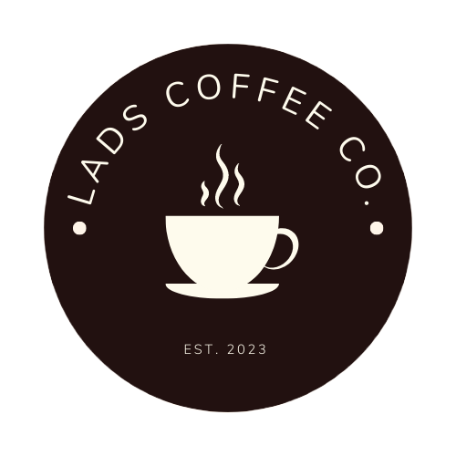

# EcommerceSite
HTML Lads Ecommerce Site for CSCD 378

    

## Running

This is a react app, executed through NodeJS. As such, `node` and `npm` are required.

* In your terminal of choice, navigate to the root folder, `.../EcommerceSite/App`
* With npm installed, you may have to install some packages if you don't have them already:
* `npm i react-scripts @react-google-maps/api react-router-dom react-dom` to fetch package dependencies.
* Inside the App directory, execute `npm start` to run the local server.
* In your browser, navigate to `http://localhost:3000/` if it doesn't automatically open

## Server Running

We utilize MySQL, meaning you will need a the test server installed on your computer - MySQL community server.

This should install a service which default is named MySQL80
-It must be running for this to work

Using the desired method, either terminal or using mysql workbench run the final_turnindbscript.sql script

You will also need to add a user to be able to access the database 

* In your terminal of choice, navigate to the root folder, `.../EcommerceSite/server`
* Once in the server folder to install the dependencies: 
* `npm i body-parser express mysql promise-mysql`
* Now inside the server folder run `npm start`

## Features

* A functional (though locally stored) cart and shop are available.
* A maps page is implemented, which shows the use of the Google Maps API to list store locations.
* A footer and header with commonly accessed features and a complete site map are present on every page, making navigation from one page to any other intuitive.
* Reactive elements through animations make the page feel dynamic and interactive.

Accessibility

* On each page, pressing tab once when the page loads allows the user to skip to the main  content, skipping the navigation panel.
* The icons used for the search, user account, and cart provide additional information to a screen reader, allowing the icons to be read aloud as text.
* `prefers-reduced-motion` is implemented for all the animations and transitions on the site.
* `aria-hidden` is used on some decorative elements to prevent decorative elements from interfering with navigation by caret or audio.
* Relative sizing is used for all text elements on the page, meaning the site will respond to users with different font size preferences.

